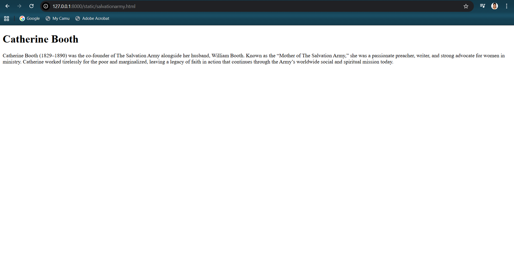
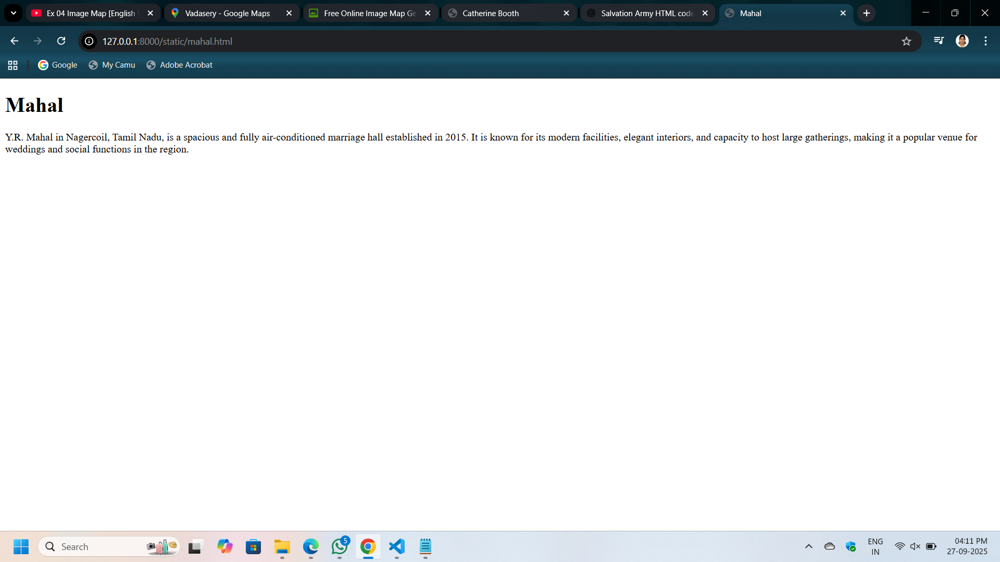
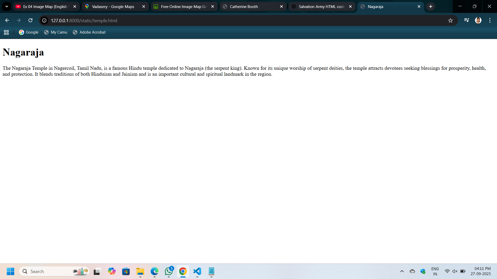

# Ex04 Places Around Me
## Date: 27-09-2025

## AIM
To develop a website to display details about the places around my house.

## DESIGN STEPS

### STEP 1
Create a Django admin interface.

### STEP 2
Download your city map from Google.

### STEP 3
Using ```<map>``` tag name the map.

### STEP 4
Create clickable regions in the image using ```<area>``` tag.

### STEP 5
Write HTML programs for all the regions identified.

### STEP 6
Execute the programs and publish them.

## CODE
~~~
map.html

<!DOCTYPE html>
<html lang="en">
<head>
  <meta charset="UTF-8">
  <title>Image Map Example</title>
</head>
<body>

  <!-- Image Map Generated by http://www.image-map.net/ -->
  

  <map name="image-map">
    <area target="_self" alt="army" title="army" href="salvationarmy.html" coords="520,19,757,128" shape="rect">
    <area target="_self" alt="kovil" title="kovil" href="temple.html" coords="664,511,863,613" shape="rect">
    <area target="_self" alt="yr" title="yr" href="mahal.html" coords="227,663,413,757" shape="rect">
  </map>

</body>
</html>

mahal.html

<!DOCTYPE html>
<html lang="en">
<head>
  <meta charset="UTF-8">
  <title>Mahal</title>
</head>
<body>
  <h1><b>Mahal</b></h1>
  <p>
    Y.R. Mahal in Nagercoil, Tamil Nadu, is a spacious and fully air-conditioned marriage hall established in 2015. 
    It is known for its modern facilities, elegant interiors, and capacity to host large gatherings, 
    making it a popular venue for weddings and social functions in the region.
  </p>
</body>
</html>

salvationarmy.html

<!DOCTYPE html>
<html lang="en">
<head>
  <meta charset="UTF-8">
  <title>Catherine Booth</title>
</head>
<body>
  <h1><b>Catherine Booth</b></h1>
  <p>
    Catherine Booth (1829–1890) was the co-founder of The Salvation Army alongside her husband, William Booth. 
    Known as the “Mother of The Salvation Army,” she was a passionate preacher, writer, and strong advocate for women in ministry. 
    Catherine worked tirelessly for the poor and marginalized, leaving a legacy of faith in action that continues through the Army’s worldwide social and spiritual mission today.
  </p>
</body>
</html>

temple.html
<!DOCTYPE html>
<html lang="en">
<head>
  <meta charset="UTF-8">
  <title>Nagaraja</title>
</head>
<body>
  <h1><b>Nagaraja</b></h1>
  <p>
    The Nagaraja Temple in Nagercoil, Tamil Nadu, is a famous Hindu temple dedicated to Nagaraja (the serpent king). 
    Known for its unique worship of serpent deities, the temple attracts devotees seeking blessings for prosperity, health, and protection. 
    It blends traditions of both Hinduism and Jainism and is an important cultural and spiritual landmark in the region.
  </p>
</body>
</html>
~~~


## OUTPUT








## RESULT
The program for implementing image maps using HTML is executed successfully.
